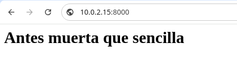

# Tarea 3

**Descarga la imagen 'httpd' y comprueba que está en tu equipo.**
    
    sudo docker pull httpd:2.4
 
1.png)

````
 sudo docker images
 ````


**Crea un contenedor con el nombre 'dam_web1'.**

````
sudo docker create --name dam_wey1 httpd:2.4
````

t_20241018_114753.png](img/Screenshot_20241018_114753.png)

### Si quieres poder acceder desde el navegador de tu equipo, ¿que debes hacer?


Para comprobar que se conecta al navegador podemos hacer un curl 


Y luego colocamos  http://localhost:8000/ en el navegador

El reusltado es este 


### Utiliza bind mount para que el directorio del apache2 'htdocs' esté montado un directorio que tu elijas.


### Realiza un 'hola mundo' en html y comprueba que accedes desde el navegador.

Realizamos un fichero html con Hola Mundo escrito

     <head>
         <title>Prueba HOola Mundo</title>
     </head>
     <body>
         <h1>Hola Mundo</h1>
     </body>

Y refrescamos la pagina web y vemos su contenido 


### Crea otro contenedor 'dam_web2' con el mismo bind mount y a otro puerto, por ejemplo 9080.

sudo docker run -d --name dam_web2 -p 9800:80 -v $(pwd):/usr/local/apache2/htdocs httpd:2.4

### Comprobamos con el comando la creación del contenedor:


El resultado de la página web http://10.0.2.15:9800/


### Realiza modificaciones de la página y comprueba que los dos servidores 'sirven' la misma página

    <head>
         <title> Hola Mundo</title>
     </head>
     <body>
         <h1>Antes muerta que sencilla</h1>
     </body>




