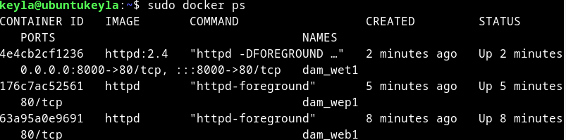
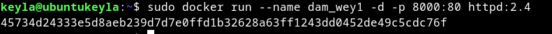
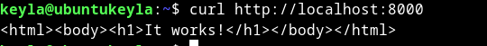
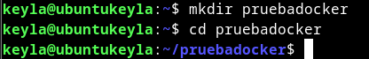
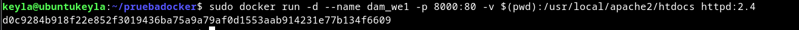
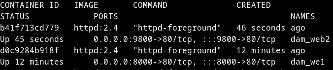

# Tarea 3

**Descarga la imagen 'httpd' y comprueba que está en tu equipo.**

Para ello utilizamos el comando para buscar la img
    
    sudo docker pull httpd:2.4
 


Comprobamos si la tenemos en nuestro docker como img

````
 sudo docker images
 ````


**Crea un contenedor con el nombre 'dam_web1'.**

Creamos el contenedor 

````
sudo docker create --name dam_wey1 httpd:2.4
````

t_20241018_114753.png](img/Screenshot_20241018_114753.png)

### Si quieres poder acceder desde el navegador de tu equipo, ¿que debes hacer?

Para acceder desde el navegador debemos colocar una ip como parametro en el comando de creación del contenedor




Para comprobar que se conecta al navegador podemos hacer un curl, el curl nos devuelve el contenido de la pagina web en html



Para comprobarlo insitu colocamos  http://localhost:8000/ en el navegador

El reusltado es este 


### Utiliza bind mount para que el directorio del apache2 'htdocs' esté montado un directorio que tu elijas.

Primero creamos un directorio en el que se montara el directorio htdocs




Luego utilizamos la estructura bindmount para escoger el directorio en el qeu queremos montar, como ya estamos en él gracias al cd podemos utilizar el subcomando pwd




### Realiza un 'hola mundo' en html y comprueba que accedes desde el navegador.

Realizamos un fichero html con Hola Mundo escrito y lo colocamos como el segundo parametro en nuestro navegador (dependiendo del nombre del html, colocaremos uno u otro, en mi caso ha sido Index.html)

     <head>
         <title>Prueba HOola Mundo</title>
     </head>
     <body>
         <h1>Hola Mundo</h1>
     </body>

Modificamos el nombre http://10.0.2.15:9800/Index.html y vemos su contenido 


### Crea otro contenedor 'dam_web2' con el mismo bind mount y a otro puerto, por ejemplo 9080.

````
sudo docker run -d --name dam_web2 -p 9800:80 -v $(pwd):/usr/local/apache2/htdocs httpd:2.4
````

### Comprobamos con el comando la creación del contenedor:



El resultado de la página web http://10.0.2.15:9800 es:


### Realiza modificaciones de la página y comprueba que los dos servidores 'sirven' la misma página

Modificamos el html

    <head>
         <title> Hola Mundo</title>
     </head>
     <body>
         <h1>Antes muerta que sencilla</h1>
     </body>

Comprobamos el html en los navegadores


