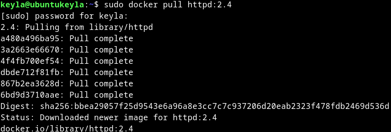
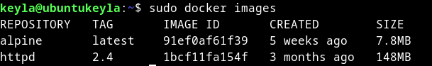
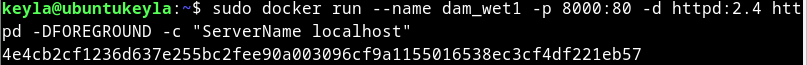

# Tarea 3

**Descarga la imagen 'httpd' y comprueba que está en tu equipo.**
    
    sudo docker pull httpd:2.4
 
1.png)

````
 sudo docker images
 ````



**Crea un contenedor con el nombre 'dam_web1'.**

````
sudo docker run --name dam_wet1 -p 8000:80 -d httpd:2.4 httpd -DFOREGROUND -c "ServerName localhost"
````



